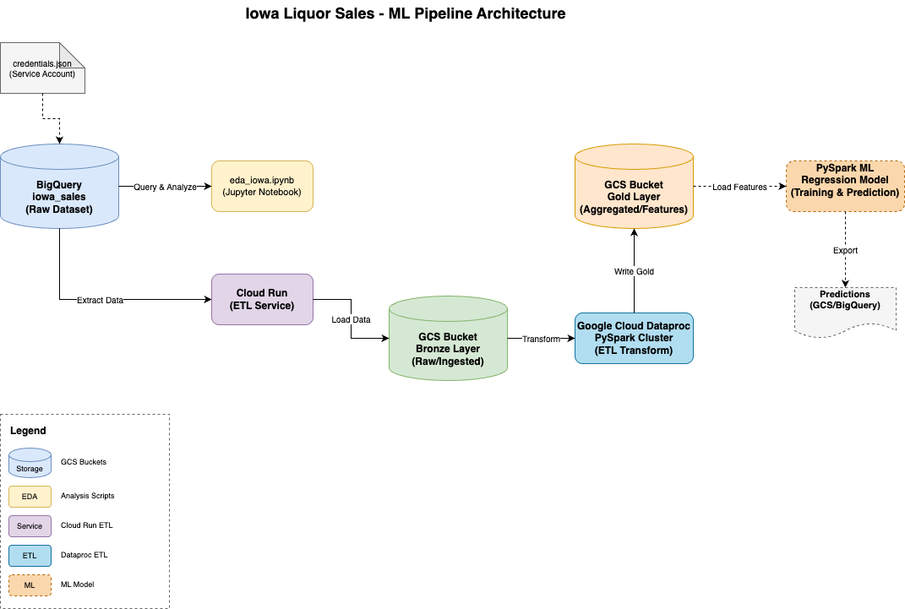

# Iowa Liquor Sales - ML Pipeline

Proyecto de analítica predictiva en entornos de datos masivos utilizando arquitectura medallion (Bronze/Gold) con procesamiento distribuido en Google Cloud Platform.

## Arquitectura



**Flujo de datos:**
1. **BigQuery** → Dataset público `iowa_liquor_sales` (32M+ registros)
2. **EDA** → Análisis exploratorio con scripts Python
3. **Cloud Run** → Extracción ETL hacia capa Bronze (GCS)
4. **Dataproc** → Transformación distribuida PySpark hacia capa Gold (GCS)
5. **ML Model** → Modelo de regresión PySpark (Planeado)

## Estructura del Proyecto

```
├── src/
│   ├── eda/                    # Análisis exploratorio
│   │   ├── eda_iowa.py         # Script CLI
│   │   └── eda_iowa.ipynb      # Notebook interactivo
│   ├── cloud_run/              # ETL Bronze layer
│   │   ├── bronze_extract.py   # Extracción desde BigQuery
│   │   └── Dockerfile
│   ├── dataproc/               # ETL Gold layer
│   │   └── gold_transform.py   # Transformación PySpark
│   ├── infra/                  # Infraestructura como código
│   │   ├── main.tf             # Terraform Dataproc clusters
│   │   └── architecture/       # Diagramas de arquitectura
│   ├── runs/                   # Resultados de ejecuciones
│   └── results/                # Métricas y comparativas
└── docs/                       # Documentación del proyecto
```

## Componentes Implementados

### 1. EDA (Exploratory Data Analysis)
- **Script CLI**: `src/eda/eda_iowa.py`
- **Notebook**: `src/eda/eda_iowa.ipynb`
- Consulta directa a BigQuery para análisis inicial

### 2. Bronze Layer (Cloud Run)
- **Script**: `src/cloud_run/bronze_extract.py`
- Extrae datos desde BigQuery público
- Almacena en GCS bucket como Parquet particionado
- Ejecuta como Cloud Run Job

### 3. Gold Layer (Dataproc)
- **Script**: `src/dataproc/gold_transform.py`
- Lee Bronze layer desde GCS
- Limpieza, transformación y feature engineering con PySpark
- Escribe Gold layer particionado en GCS
- Soporta múltiples configuraciones de cluster

### 4. Infraestructura (Terraform)
- **Configuración**: `src/infra/main.tf`
- Provisiona clusters Dataproc con diferentes configuraciones
- Variables para comparación de performance

## Componentes Planeados

### 5. ML Model (PySpark en Dataproc) ***PLANNED***
**Objetivo**: Modelo de regresión supervisado para predicción de ventas

**Tareas pendientes:**
- [ ] ***PLANNED*** Implementar modelo de regresión lineal con PySpark MLlib
- [ ] ***PLANNED*** Entrenamiento sobre Gold layer
- [ ] ***PLANNED*** Evaluación con métricas: R², RMSE, MAE
- [ ] ***PLANNED*** Comparación de performance entre configuraciones de cluster
- [ ] ***PLANNED*** Exportación de predicciones a GCS/BigQuery
- [ ] ***PLANNED*** Análisis de feature importance

**Script planeado**: `src/dataproc/ml_regression.py` ***PLANNED***

## Requisitos

### Python
- Python 3.10+
- Paquetes:
  ```bash
  pip install google-cloud-bigquery google-cloud-storage pandas pyarrow db-dtypes pyspark
  ```

### GCP
- Proyecto GCP activo
- APIs habilitadas: BigQuery, Cloud Storage, Cloud Run, Dataproc
- Service Account con permisos necesarios

### Credenciales
- Coloca `credentials.json` en `src/` o exporta:
  ```bash
  export GOOGLE_APPLICATION_CREDENTIALS="path/to/credentials.json"
  ```

## Uso

### EDA
```bash
cd src/eda
python eda_iowa.py
```

### Bronze Layer (Cloud Run)
```bash
cd src/cloud_run
gcloud run jobs execute bronze-extract --region us-central1
```

### Gold Layer (Dataproc)
```bash
cd src/dataproc
gcloud dataproc jobs submit pyspark gold_transform.py \
  --cluster=iowa-cluster1 \
  --region=us-central1
```

### Infraestructura
```bash
cd src/infra
terraform init
terraform apply -var-file="cluster1.tfvars"
```

## Resultados

Los resultados de ejecuciones y métricas se almacenan en:
- `src/runs/` - Logs y timings por ejecución
- `src/results/` - Comparativas de performance

## Dataset

**Fuente**: BigQuery Public Data  
**Tabla**: `bigquery-public-data.iowa_liquor_sales.sales`  
**Tamaño**: 32+ millones de registros  
**Descripción**: Ventas de licores en Iowa, USA

## Licencia

Proyecto académico - Universidad Panamericana
